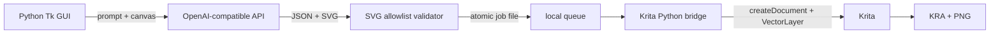

# krita-prompt-canvas

一个提示词驱动的 Krita 矢量创作工程：用户在 Python GUI 中描述画面，第三方
OpenAI 兼容 API 负责输出结构化 SVG 方案，Krita Python 插件在主线程中创建可编辑
文档并导出 `.kra` 与 `.png`。

> 当前定位是“LLM 作为矢量美术指导”，不是 Stable Diffusion/ComfyUI 前端。

## 架构



桌面 GUI 与 Krita 使用本地原子文件队列通信。这样做有两个好处：Krita 内置 Python
无需安装第三方依赖，所有 Krita API 调用也始终发生在 Qt/Krita 主线程。

## 主要特性

- 可配置任意支持 `/v1/chat/completions` 的 OpenAI 兼容服务和模型名。
- 不把 API key 写入磁盘；可通过 GUI 或 `KPC_API_KEY` 环境变量提供。
- 模型响应必须通过 XML 解析、元素白名单、外部资源禁用和尺寸校验。
- 强制单个顶层 `<g id="scene">`，避免 Krita 导入多个 SVG 顶层对象时层叠反转。
- Krita 文档使用批处理模式保存，避免 PNG 导出选项对话框阻塞自动流程。
- 每次输出一个可编辑 KRA 和一个 PNG 预览。
- GUI 可安装/更新 Krita 插件，并可启动指定的 Krita 可执行文件。
- 无运行时第三方 Python 依赖；GUI 使用标准库 Tkinter。

## 快速开始

要求：Python 3.10+、Krita 5.x，以及一个 OpenAI 兼容 Chat Completions 服务。

```powershell
git clone https://github.com/rsw510670993/krita-prompt-canvas.git
cd krita-prompt-canvas
python -m venv .venv
.\.venv\Scripts\Activate.ps1
pip install -e .
krita-prompt-canvas
```

Windows 用户完成克隆后，也可以直接双击根目录中的
`启动-Krita-Prompt-Canvas.cmd`。启动器会优先使用项目的 `.venv`；如果没有虚拟环境，
则使用系统 Python，并自动设置源码路径，不需要手动激活环境。

首次使用：

1. 在 GUI 中点击 **安装 / 更新 Krita 插件**。
2. 打开 Krita 的 **Settings → Configure Krita → Python Plugin Manager**。
3. 启用 **Krita Prompt Canvas Bridge**，重启 Krita一次。
4. 在 GUI 中填写 API base URL、模型名和 API key。
5. 输入创作需求，选择输出目录，点击 **开始创作**。

可用环境变量参见 [.env.example](.env.example)。环境变量只由进程读取；项目不会自动
加载 `.env`，以免无意持久化密钥。

## OpenAI 兼容协议

客户端请求：

```text
POST {base_url}/chat/completions
Authorization: Bearer {api_key}
Content-Type: application/json
```

客户端优先发送 `response_format={"type":"json_object"}`。如果兼容服务返回 HTTP
400/422，会自动降级为纯提示词约束的 JSON 输出。响应仍必须符合以下字段：

```json
{
  "title": "Morning Warm-up",
  "width": 1200,
  "height": 800,
  "svg": "<svg ...><g id=\"scene\">...</g></svg>",
  "palette": ["#ff8fbd", "#8bd6e8"],
  "notes": "short composition note"
}
```

## 从实机验证中总结的经验

1. Windows 某些 Krita 构建中的 `kritarunner` 会停在初始化阶段，因此正式架构采用
   常驻插件和本地任务队列。
2. `VectorLayer.addShapesFromSvg()` 导入多个顶层可见对象时可能反向堆叠；单一 scene
   group 能稳定保持 SVG 内部绘制顺序。
3. 保存和导出前调用 `Document.setBatchmode(True)`，可防止格式选项对话框阻塞。
4. 桌面 Python 与 Krita 内置 Python 分离，避免把 HTTP SDK 等依赖塞进 Krita 环境。
5. 模型输出视为不可信输入：GUI 和 Krita 插件各做一次安全检查。
6. 插件安装与插件启用分开。安装器只复制文件，不在 Krita 运行时改写 `kritarc`。

## 相关项目调研

- [Krita-Prompt-Builder](https://github.com/MystiaTech/Krita-Prompt-Builder)：Krita 内的
  标签/提示词构建器，不负责调用通用 OpenAI 兼容模型生成 SVG。
- [krita-cli](https://github.com/edithatogo/krita-cli)：功能全面的 Krita CLI/MCP 桥，
  定位是通用 Agent 操作接口。
- [krita-ai-diffusion](https://github.com/Acly/krita-ai-diffusion)：成熟的扩散模型工作流，
  面向栅格生成而非 LLM 指导的可编辑 SVG。

本工程聚焦更小的闭环：自然语言 → 受约束 SVG → Krita 可编辑矢量文档。

## 开发与测试

```powershell
python -m unittest discover -s tests -v
```

测试不要求启动 Krita。真正的 Krita 端到端验证需要安装并启用 bridge，然后运行
`examples/enqueue_demo.py`。

## 安全边界

参见 [SECURITY.md](SECURITY.md)。尤其不要把 API key 提交到仓库，也不要连接不可信
的兼容服务。模型返回的 SVG 不允许脚本、图片、外链、data URI 或事件处理属性。

## License

MIT
